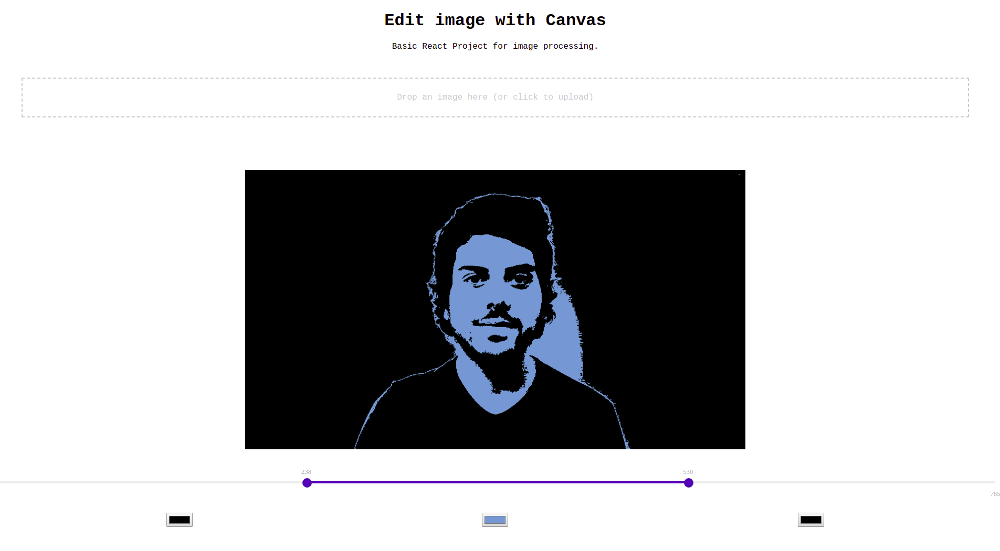

This project was bootstrapped with [Create React App](https://github.com/facebook/create-react-app).

## Instructions

### `npm start` or `yarn start`

Runs the app in development mode. 
Open [http://localhost:3000](http://localhost:3000) to view it in the browser.

The page will automatically reload if you make changes to the code. 
You will see the build errors and lint warnings in the console.

### `npm test` or `yarn test`

Runs the test watcher in an interactive mode. 
By default, runs tests related to files changed since the last commit.

[Read more about testing.](https://facebook.github.io/create-react-app/docs/running-tests)

### `npm run build` or `yarn build`

Builds the app for production to the `build` folder. 
It correctly bundles React in production mode and optimizes the build for the best performance.

The build is minified and the filenames include the hashes. 

Your app is ready to be deployed.

For further information, follow the instructions on the React Create App [repository](https://github.com/facebook/create-react-app).

## What I want to build
Basic React Project for image processing. This example allows a user to reduce an image in 3 or 2 colors and replace each area by a new custom color.

## Screenshot

## Collaborations
Do you want to improve the code? Collaborations are welcomed.

## License
This project is licensed under the MIT License - see the [LICENSE.md](LICENSE.md) file for details.
